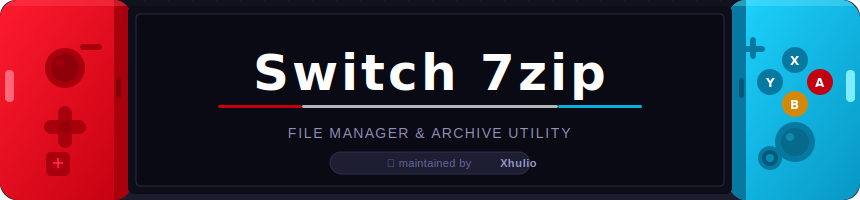

<div align="center">



<br/>


> **⚠️ Pre-1.0 — not fully tested.**  
> Back up your SD card before using any destructive or bulk operations.

</div>

---

## 📖 Table of Contents

- [Overview](#-overview)
- [Features](#-features)
- [FAT32 Large-File Handling](#-fat32-large-file-handling)
- [Controls](#-controls)
- [Build Instructions](#-build-instructions)
- [Runtime File Layout](#-runtime-file-layout)
- [Applet Mode Warning](#-applet-mode-warning)
- [Known Limitations & Roadmap](#-known-limitations--roadmap)
- [Safety Scope](#-safety-scope)
- [License](#-license)

---

## 🕹️ Overview

**Switch 7zip** is a homebrew file manager and archive utility for the Nintendo Switch, designed around the realities of the HAC-001 handheld screen and FAT32 SD cards.

It lets you browse your SD card, inspect and selectively extract archives, compress files to ZIP, and gracefully handle the FAT32 4 GiB file-size ceiling — all through a native SDL2 interface built for the Switch's physical controls.

> **Not affiliated with** Nintendo, 7-Zip, Igor Pavlov, libarchive, or devkitPro.  
> No 7-Zip binaries or LZMA SDK code are included or redistributed.

---

## ✨ Features

### 🗂️ File Management
- SD card browser with sorting, filtering, and dual-pane helpers
- File copy, move, rename, new folder and file creation
- Trash and restore workflow
- Bookmarks and recent folders

### 🗜️ Archive Support
- Extraction via **libarchive**
- Archive preview and **selective extraction**
- **ZIP compression**
- Multipart archive diagnostics

### 💾 Large-File & FAT32 Safety
- Free-space preflight before large operations
- FAT32 4 GiB guard
- Three configurable oversized-file modes *(see below)*

### 🔍 Viewers & Editors
- Text / log / config viewer with small inline editor
- Hex viewer
- PNG / JPG / BMP image viewer *(requires `switch-sdl2_image`)*

### 📋 Diagnostics & Logging
- Operation logs: `latest.log` and `failed_operation.txt`
- One-tap diagnostic bundle export
- Applet Mode warning for safer large-archive work

---

## 💾 FAT32 Large-File Handling

FAT32 cannot store a single file larger than **4 GiB − 1 byte**. Switch 7zip exposes three modes to handle oversized files during extraction:

| Mode | Behavior |
|---|---|
| `BLOCK` | **Default.** Refuses to extract any single file that would exceed 4 GiB. Safest choice. |
| `SPLIT` | Writes oversized files as FAT32-safe `.part` chunks inside a `.split/` folder. |
| `CONCAT` | Writes oversized files as Switch concatenation folders and attempts to set the archive/concatenation attribute. Switch-specific. |

### How to enable SPLIT or CONCAT

`SPLIT` and `CONCAT` are not triggered by archive size alone. They are only used when an **individual file inside the archive** is larger than FAT32 allows.

To enable one of these modes:

1. Launch **Switch 7zip**.
2. Press **`+`** to open the action menu.
3. Open **Settings**.
4. Find the FAT32 oversized-file handling option.
5. Change the mode from `BLOCK` to `SPLIT` or `CONCAT`.
6. Exit Settings.
7. Select the archive.
8. Press **`X`** to extract.

Use `SPLIT` when you only need to store or move the oversized output on FAT32. Use `CONCAT` only when another Switch tool expects Horizon OS concatenated-file folders.

<details>
<summary><b>Example output structures</b></summary>

**SPLIT mode:**
```
bigfile.bin.split/
  0000.part
  0001.part
  0002.part
```

**CONCAT mode:**
```
bigfile.bin/
  00
  01
  02
```

`CONCAT` output is only useful with software that understands Horizon OS's concatenated-file behavior.

</details>

---

## 🎮 Controls

| Button | Action |
|:---:|---|
| `A` | Open / confirm |
| `B` | Back / cancel |
| `X` | Extract / selected operation |
| `Y` | Mark / unmark item |
| `+` | Action menu |
| `-` | Quick paths / bookmarks |
| `L` / `R` | Page or viewer navigation |
| `ZL` | Log / viewer shortcut *(supported screens)* |
| `ZR` | Refresh / secondary action *(supported screens)* |

---

## 🔨 Build Instructions

### Prerequisites

Install devkitPro and the required Switch portlibs:

```sh
sudo dkp-pacman -Syu
sudo dkp-pacman -S switch-dev switch-libarchive switch-sdl2 switch-sdl2_image
```

### Build

```sh
make clean && make
```

This produces `Switch7zip.nro`. Copy it to your Switch:

```
sdmc:/switch/Switch7zip/Switch7zip.nro
```

---

## 📂 Runtime File Layout

All user data lives under `sdmc:/switch/Switch7zip/`:

```
sdmc:/switch/Switch7zip/
├── Switch7zip.nro
├── config.ini
├── logs/
│   ├── latest.log
│   ├── failed_operation.txt
│   └── diagnostic_bundle.txt
└── .trash/
```

---

## ⚡ Applet Mode Warning

Running homebrew in **Applet Mode** gives the app less available memory. Long operations on large archives may fail partway through as a result.

For large-archive work, **launch Switch 7zip in full-memory (title-override) mode.** The app will warn you if Applet Mode is detected, but choosing the right launch method is your responsibility.

---

## 🚧 Known Limitations & Roadmap

This section is intentionally candid. Here is what still needs work before 1.0:

<details>
<summary><b>🎨 UI / UX polish</b></summary>

The SDL2 interface is functional but not final. Planned improvements:
- Better spacing and visual hierarchy
- Cleaner modal design
- Consistent icon set
- Configurable file-row density
- Improved touch support
- Dual-pane polish
- Clearer operation-state feedback

</details>

<details>
<summary><b>📦 Extraction destination flow</b></summary>

Extraction works, but choosing a destination is awkward. A proper **Extract here** / **Extract to…** flow is planned.

</details>

<details>
<summary><b>📄 Log discoverability</b></summary>

The app writes useful diagnostic logs, but surfacing `latest.log`, `failed_operation.txt`, and the diagnostic bundle from inside the UI needs to be much more obvious.

</details>

<details>
<summary><b>⚙️ Background operations</b></summary>

Long archive operations currently block the UI. True background processing is a planned rework:
- Background worker thread
- Browsable UI during active jobs
- Job queue support
- Pause / resume where feasible
- Clear cancel / retry / skip controls

</details>

<details>
<summary><b>🗑️ Direct delete shortcut</b></summary>

Delete and Trash are available through the action menu, but there is no dedicated delete button or refined delete UX yet.

</details>

<details>
<summary><b>🧹 Source structure cleanup</b></summary>

`source/main.c` is too large and needs splitting into focused modules. This is the biggest code-quality blocker before 1.0:

```
ui.c        — rendering and layout
input.c     — controller handling
state.c     — application state
overlays.c  — modals and popups
actions.c   — file and archive operations
settings.c  — config persistence
```

</details>

<details>
<summary><b>🧪 Testing gaps</b></summary>

The app has been validated through host smoke tests and build checks, but has **not** been fully tested across every Switch model, archive type, SD-card format, or homebrew launch mode. Use extra caution with:

- Very large archives
- Encrypted or RAR5 archives
- Multipart archives
- exFAT SD cards
- Destructive operations on important data

</details>

---

## 🛡️ Safety Scope

Switch 7zip does **not** include, require, or enable:

- Nintendo SDK or proprietary files
- Firmware or encryption keys
- Copyrighted game files
- DRM bypass material
- Piracy workflows of any kind

It is a file and archive utility for user-owned content on a homebrew-enabled Switch.

---

## 📄 License

[MIT](LICENSE)

---

